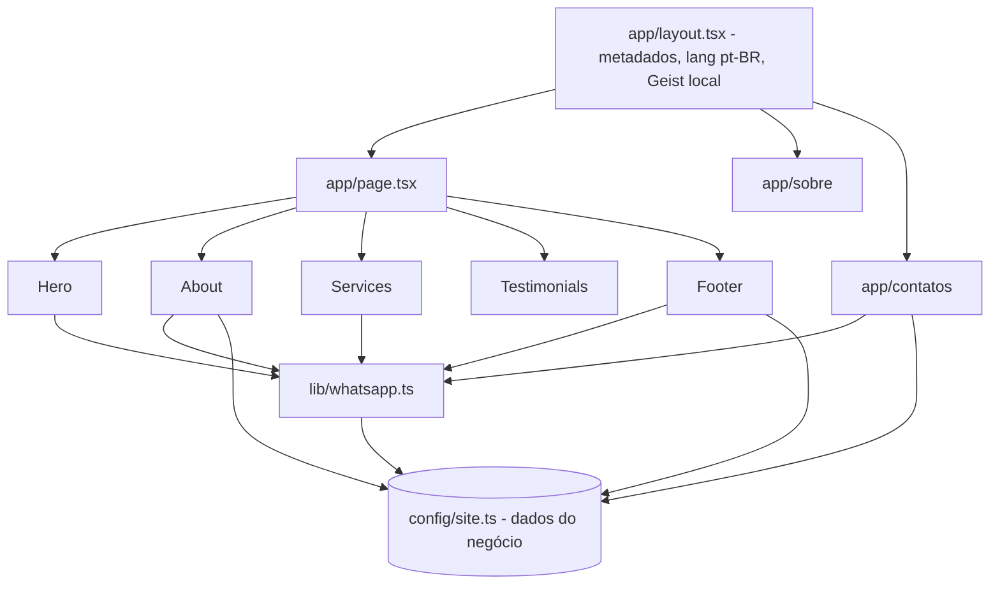

# Arquitetura — Petshop Dev

Todas as páginas são estáticas (pré-renderizadas); não há back-end.

## ADRs

| # | Decisão | Motivo | Alternativa |
|---|---|---|---|
| ADR-01 | Dados do negócio em `config/site.ts` | Trocar telefone/endereço em um lugar | Espalhados nos componentes |
| ADR-02 | Next 16 | Única linha sem vulnerabilidades no audit | Ficar no 15.x com a do postcss |
| ADR-03 | Fonte Geist pelo pacote `geist` | Build sem depender de rede; sem FOUT | `next/font/google` |
| ADR-04 | Sem animação no hero | O texto principal é o LCP | Manter AOS no hero |
